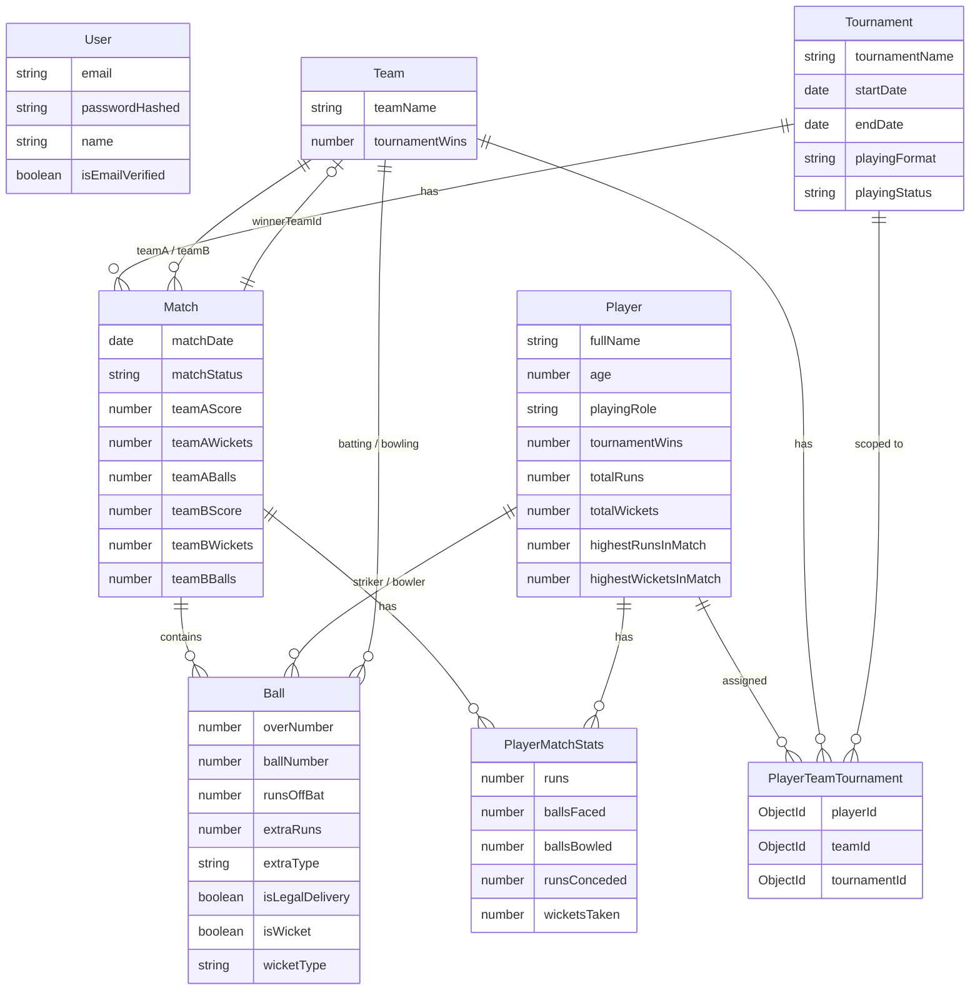

# Cricnerd Backend — Complete Codebase Index

## Tech Stack

| Layer | Technology |
|---|---|
| Language | TypeScript (ES2020, CommonJS) |
| Runtime | Node.js |
| Framework | Express 5 |
| Database | MongoDB via Mongoose 9 |
| Validation | Zod 4 |
| Auth libs | bcryptjs, jsonwebtoken, cookie-parser |
| Email | nodemailer |
| API Docs | swagger-jsdoc + swagger-ui-express |
| Dev tooling | ts-node-dev |

**Scripts:** `npm run dev` → `ts-node-dev --respawn --transpile-only src/index.ts`

---

## Directory Tree

```
backend/
├── .env                          # MONGO_URI (+ PORT optional)
├── package.json
├── tsconfig.json
├── Plan.md                       # Development plan / checklist
└── src/
    ├── index.ts                  # Entry point — connects DB, starts HTTP server
    ├── app.ts                    # Express app setup, middleware, route mounting
    ├── config/
    │   ├── swagger.ts            # Swagger/OpenAPI 3.0 config
    │   └── swagger.txt           # Notes
    ├── constants/
    │   ├── extraTypes.constant.ts
    │   ├── matchStatus.constant.ts
    │   ├── playingFormat.constant.ts
    │   ├── playingRole.constant.ts
    │   ├── playingStatus.constant.ts
    │   └── wicketTypes.constant.ts
    ├── controllers/
    │   ├── auth/
    │   │   ├── auth.controller.ts
    │   │   └── auth.schema.ts
    │   ├── ball/
    │   │   ├── ball.controller.ts
    │   │   ├── ball.schema.ts
    │   │   └── upsert.txt
    │   ├── match/
    │   │   ├── match.controller.ts
    │   │   ├── match.schema.ts
    │   │   └── notesOnIds.txt
    │   ├── player/
    │   │   ├── player.controller.ts
    │   │   └── player.schema.ts
    │   ├── playerTeamTournament/
    │   │   ├── playerTeamTournament.controller.ts
    │   │   ├── playerTeamTournamentParams.schema.ts
    │   │   └── note.txt
    │   ├── team/
    │   │   ├── team.controller.ts
    │   │   └── team.schema.ts
    │   └── tournament/
    │       ├── tournament.controller.ts
    │       └── tournament.schema.ts
    ├── db/
    │   └── db.ts                 # Mongoose connection (MONGO_URI)
    ├── models/
    │   ├── ball.model.ts
    │   ├── match.model.ts
    │   ├── matchPlayingXI.model.ts
    │   ├── player.model.ts
    │   ├── playerMatchStats.model.ts
    │   ├── playerTeamTournament.model.ts
    │   ├── team.model.ts
    │   ├── tournament.model.ts
    │   └── user.model.ts
    ├── routes/
    │   ├── ball.routes.ts
    │   ├── match.routes.ts       # Has Swagger JSDoc annotations
    │   ├── player.routes.ts
    │   ├── playerteamtournament.routes.ts
    │   ├── team.routes.ts
    │   └── tournament.routes.ts
    ├── schemas/
    │   └── params.schema.ts      # Shared Zod schema for `:id` params
    └── services/
        ├── validateMatchDate.ts
        └── validateTournamentDate.ts
```

---

## Entry Point & App Setup

### [index.ts](file:///e:/Stack.io/backend/src/index.ts)
- Calls `connectDB()`, then creates an HTTP server on `PORT` (default 3000).

### [app.ts](file:///e:/Stack.io/backend/src/app.ts)
- Middleware: `express.json()`
- Swagger UI mounted at `/api-docs`
- Route mounting:

| Prefix | Router |
|---|---|
| `/players` | playerRoute |
| `/teams` | teamRouter |
| `/tournaments` | tournamentRouter |
| `/tournaments` | playerTeamTournamentRouter |
| `/matches` | matchRouter |
| `/balls` | ballRouter |

---

## Constants (Enums)

| File | Constant | Values |
|---|---|---|
| [playingRole.constant.ts](file:///e:/Stack.io/backend/src/constants/playingRole.constant.ts) | `PLAYING_ROLES` | `Batter`, `Bowler`, `Allrounder` |
| [playingFormat.constant.ts](file:///e:/Stack.io/backend/src/constants/playingFormat.constant.ts) | `PLAYING_FORMAT` | `5 Overs`, `6 Overs`, `20 Overs` |
| [playingStatus.constant.ts](file:///e:/Stack.io/backend/src/constants/playingStatus.constant.ts) | `PLAYING_STATUS` | `UPCOMING`, `ONGOING`, `COMPLETED` |
| [matchStatus.constant.ts](file:///e:/Stack.io/backend/src/constants/matchStatus.constant.ts) | `MATCH_STATUS` | `SCHEDULED`, `LIVE`, `COMPLETED` |
| [extraTypes.constant.ts](file:///e:/Stack.io/backend/src/constants/extraTypes.constant.ts) | `EXTRA_TYPES` | `NONE`, `DEAD`, `WIDE`, `NO_BALL` |
| [wicketTypes.constant.ts](file:///e:/Stack.io/backend/src/constants/wicketTypes.constant.ts) | `WICKET_TYPES` | `BOWLED`, `CAUGHT`, `STUMPED`, `HIT_WICKET` |

---

## Models (Mongoose Schemas)

### [Player](file:///e:/Stack.io/backend/src/models/player.model.ts)
| Field | Type | Notes |
|---|---|---|
| `fullName` | String | required, trimmed |
| `age` | Number | min 10 |
| `playingRole` | String | enum: `PLAYING_ROLES` |
| `tournamentWins` | Number | default 0 |
| `totalRuns` | Number | default 0 (career) |
| `totalWickets` | Number | default 0 (career) |
| `highestRunsInMatch` | Number | default 0 |
| `highestWicketsInMatch` | Number | default 0 |
| *timestamps* | auto | createdAt, updatedAt |

---

### [Team](file:///e:/Stack.io/backend/src/models/team.model.ts)
| Field | Type | Notes |
|---|---|---|
| `teamName` | String | required |
| `tournamentWins` | Number | default 0 |
| *timestamps* | auto | |

---

### [Tournament](file:///e:/Stack.io/backend/src/models/tournament.model.ts)
| Field | Type | Notes |
|---|---|---|
| `tournamentName` | String | required |
| `startDate` | Date | required |
| `endDate` | Date | required |
| `playingFormat` | String | enum: `PLAYING_FORMAT` |
| `playingStatus` | String | enum: `PLAYING_STATUS`, default `UPCOMING` |

---

### [Match](file:///e:/Stack.io/backend/src/models/match.model.ts)
| Field | Type | Notes |
|---|---|---|
| `tournamentId` | ObjectId → Tournament | required |
| `teamAId` | ObjectId → Team | required |
| `teamBId` | ObjectId → Team | required |
| `matchDate` | Date | required |
| `matchStatus` | String | enum: `MATCH_STATUS`, default `SCHEDULED` |
| `teamAScore` | Number | default 0 |
| `teamAWickets` | Number | default 0 |
| `teamABalls` | Number | default 0 |
| `teamBScore` | Number | default 0 |
| `teamBWickets` | Number | default 0 |
| `teamBBalls` | Number | default 0 |
| `winnerTeamId` | ObjectId → Team | nullable |
| *timestamps* | auto | |

---

### [Ball](file:///e:/Stack.io/backend/src/models/ball.model.ts)
| Field | Type | Notes |
|---|---|---|
| `matchId` | ObjectId → Match | required |
| `battingTeamId` | ObjectId → Team | required |
| `bowlingTeamId` | ObjectId → Team | required |
| `strikerId` | ObjectId → Player | required |
| `bowlerId` | ObjectId → Player | required |
| `overNumber` | Number | required |
| `ballNumber` | Number | required |
| `runsOffBat` | Number | default 0 |
| `extraRuns` | Number | default 0 |
| `extraType` | String | enum: `EXTRA_TYPES`, default `NONE` |
| `isLegalDelivery` | Boolean | default false |
| `isWicket` | Boolean | default false |
| `dismissedPlayerId` | ObjectId → Player | optional |
| `wicketType` | String | enum: `WICKET_TYPES`, optional |
| *timestamps* | auto | |

---

### [PlayerTeamTournament](file:///e:/Stack.io/backend/src/models/playerTeamTournament.model.ts)
Links a player to a team within a specific tournament (squad assignment).

| Field | Type |
|---|---|
| `playerId` | ObjectId → Player |
| `teamId` | ObjectId → Team |
| `tournamentId` | ObjectId → Tournament |

> **Unique Index:** `{ playerId, tournamentId }` — a player can only be on one team per tournament.

---

### [PlayerMatchStats](file:///e:/Stack.io/backend/src/models/playerMatchStats.model.ts)
Per-player per-match performance record (upserted per ball).

| Field | Type | Notes |
|---|---|---|
| `matchId` | ObjectId → Match | required |
| `playerId` | ObjectId → Player | required |
| `runs` | Number | default 0 (batting) |
| `ballsFaced` | Number | default 0 |
| `ballsBowled` | Number | default 0 |
| `runsConceded` | Number | default 0 |
| `wicketsTaken` | Number | default 0 |

> **Unique Index:** `{ matchId, playerId }`

---

### [MatchPlayingXI](file:///e:/Stack.io/backend/src/models/matchPlayingXI.model.ts)
> ⚠️ **Scraped / Not in use.** Defines a playing XI for a match (playerId, teamId, matchId).

---

### [User](file:///e:/Stack.io/backend/src/models/user.model.ts)
| Field | Type | Notes |
|---|---|---|
| `email` | String | required, lowercase, trimmed |
| `passwordHashed` | String | required |
| `name` | String | optional |
| `isEmailVerified` | Boolean | default false |

---

## Controllers & Business Logic

### Auth — [auth.controller.ts](file:///e:/Stack.io/backend/src/controllers/auth/auth.controller.ts)

> ⚠️ **Incomplete — WIP.** `registerHandler` is partially written (password hash line is empty, no route wired).

| Function | Status |
|---|---|
| `registerHandler` | 🚧 Incomplete |

**Zod Schema** ([auth.schema.ts](file:///e:/Stack.io/backend/src/controllers/auth/auth.schema.ts)): `{ email, password, username }`

---

### Player — [player.controller.ts](file:///e:/Stack.io/backend/src/controllers/player/player.controller.ts)

| Function | Description |
|---|---|
| `addPlayer` | Create player (checks duplicate by `fullName`) |
| `getPlayers` | List all players (`.lean()`) |
| `getPlayerById` | Get single player by ID |
| `deletePlayer` | Delete player by ID |

**Zod Schema** ([player.schema.ts](file:///e:/Stack.io/backend/src/controllers/player/player.schema.ts)): `{ name: string, age: number (min 12), playingRole: enum }`

---

### Team — [team.controller.ts](file:///e:/Stack.io/backend/src/controllers/team/team.controller.ts)

| Function | Description |
|---|---|
| `addTeam` | Create team (checks duplicate by `teamName`) |
| `getTeams` | List all teams |
| `getTeamById` | Get single team |
| `deleteTeam` | Delete team by ID |
| `updateTeam` | Update team name via PATCH |

**Zod Schema** ([team.schema.ts](file:///e:/Stack.io/backend/src/controllers/team/team.schema.ts)): `{ name: string }`

---

### Tournament — [tournament.controller.ts](file:///e:/Stack.io/backend/src/controllers/tournament/tournament.controller.ts)

| Function | Description |
|---|---|
| `addTournament` | Create tournament (validates dates via service, checks duplicate name) |
| `getTournaments` | List all tournaments |
| `getTournamentById` | Get single tournament |
| `deleteTournament` | Delete tournament |
| `updateTournamentStatus` | State machine: `UPCOMING → ONGOING → COMPLETED` |

**Zod Schemas** ([tournament.schema.ts](file:///e:/Stack.io/backend/src/controllers/tournament/tournament.schema.ts)):
- `tournamentSchema`: `{ name, startDate, endDate, playingFormat, playingStatus? }`
- `updateTournamentStatusSchema`: `{ playingStatus }`

---

### PlayerTeamTournament — [playerTeamTournament.controller.ts](file:///e:/Stack.io/backend/src/controllers/playerTeamTournament/playerTeamTournament.controller.ts)

| Function | Description |
|---|---|
| `assignPlayerToTeam` | Assign player to a team for a tournament (checks duplicates) |
| `getTeamSquad` | Get all players in a team for a tournament (populates player data) |
| `removePlayerFromTeam` | Remove a player from a team-tournament assignment |
| `getPlayerTournamentTeam` | Find which team a player belongs to in a tournament |

**Zod Schema** ([playerTeamTournamentParams.schema.ts](file:///e:/Stack.io/backend/src/controllers/playerTeamTournament/playerTeamTournamentParams.schema.ts)):
`{ tournamentId: string(24), teamId?: string(24), playerId?: string(24) }`

---

### Match — [match.controller.ts](file:///e:/Stack.io/backend/src/controllers/match/match.controller.ts)

| Function | Description |
|---|---|
| `createMatch` | Create match (validates teams exist, no duplicate LIVE matches, date within tournament range) |
| `getMatches` | List matches, optional `?tournamentId=` filter |
| `getMatchById` | Get single match |
| `deleteMatch` | Delete only `SCHEDULED` matches |
| `updateMatchStatus` | State machine: `SCHEDULED → LIVE → COMPLETED` |
| `getScorecard` | Full scorecard: team scores, batter stats, bowler stats, last 6 balls |
| `endMatch` | End a LIVE match: determine winner, update team wins, update player career stats (`totalRuns`, `totalWickets`, `highestRunsInMatch`, `highestWicketsInMatch`) |

**Zod Schemas** ([match.schema.ts](file:///e:/Stack.io/backend/src/controllers/match/match.schema.ts)):
- `createMatchSchema`: `{ tournamentId, teamAId, teamBId, matchDate, matchStatus? }`
- `getMatchSchema`: `{ tournamentId }`
- `updateMatchStatusSchema`: `{ matchStatus }`

---

### Ball — [ball.controller.ts](file:///e:/Stack.io/backend/src/controllers/ball/ball.controller.ts)

| Function | Description |
|---|---|
| `addBall` | Record a ball delivery with **extensive validation** |

**Key validations in `addBall`:**
1. Match must be `LIVE`
2. Reads tournament format to determine max overs (5/6/20)
3. Batting & bowling teams must be in the match
4. Striker & bowler must exist and belong to their respective teams (via `PlayerTeamTournament`)
5. Striker must not already be dismissed
6. Wicket requires `dismissedPlayerId` + `wicketType`; dismissed player must be striker
7. Wide/No-ball → `isLegalDelivery = false`; wide cannot have `runsOffBat > 0`
8. Over completion check (6 legal deliveries = over done)
9. Ball number server-side validation (sequential, accounts for illegals)

**After recording the ball, immediately updates:**
- `PlayerMatchStats` for batter (runs, ballsFaced)
- `PlayerMatchStats` for bowler (runsConceded, ballsBowled, wicketsTaken)
- `Match` aggregate scores (teamA/B Score, Wickets, Balls)

**Zod Schema** ([ball.schema.ts](file:///e:/Stack.io/backend/src/controllers/ball/ball.schema.ts)):
`{ matchId, battingTeamId, bowlingTeamId, strikerId, bowlerId, overNumber, ballNumber, runsOffBat?, extraRuns?, extraType?, isWicket?, dismissedPlayerId?, wicketType? }`

---

## API Routes Summary

### `/players`
| Method | Path | Handler |
|---|---|---|
| POST | `/players/add` | `addPlayer` |
| GET | `/players/get-players` | `getPlayers` |
| GET | `/players/get-player/:id` | `getPlayerById` |
| DELETE | `/players/delete/:id` | `deletePlayer` |

### `/teams`
| Method | Path | Handler |
|---|---|---|
| POST | `/teams/add` | `addTeam` |
| GET | `/teams/get-teams` | `getTeams` |
| GET | `/teams/get-team/:id` | `getTeamById` |
| DELETE | `/teams/delete/:id` | `deleteTeam` |
| PATCH | `/teams/update/:id` | `updateTeam` |

### `/tournaments`
| Method | Path | Handler |
|---|---|---|
| POST | `/tournaments/add` | `addTournament` |
| GET | `/tournaments/get-tournaments` | `getTournaments` |
| GET | `/tournaments/get-tournament/:id` | `getTournamentById` |
| DELETE | `/tournaments/delete/:id` | `deleteTournament` |
| PATCH | `/tournaments/:id/update-tournament-format` | `updateTournamentStatus` |

### `/tournaments` (Player-Team-Tournament)
| Method | Path | Handler |
|---|---|---|
| POST | `/tournaments/:tournamentId/teams/:teamId/players/:playerId` | `assignPlayerToTeam` |
| GET | `/tournaments/:tournamentId/teams/:teamId/squad` | `getTeamSquad` |
| DELETE | `/tournaments/:tournamentId/teams/:teamId/players/:playerId` | `removePlayerFromTeam` |
| GET | `/tournaments/:tournamentId/players/:playerId` | `getPlayerTournamentTeam` |

### `/matches`
| Method | Path | Handler |
|---|---|---|
| POST | `/matches/add` | `createMatch` |
| GET | `/matches/get-matches?tournamentId=` | `getMatches` |
| GET | `/matches/get-match/:id` | `getMatchById` |
| DELETE | `/matches/delete-match/:id` | `deleteMatch` |
| PATCH | `/matches/:id/update-match-status` | `updateMatchStatus` |
| GET | `/matches/:id/get-scorecard` | `getScorecard` |
| GET | `/matches/:id/end-match` | `endMatch` |

### `/balls`
| Method | Path | Handler |
|---|---|---|
| POST | `/balls/` | `addBall` |

---

## Services

| File | Function | Purpose |
|---|---|---|
| [validateMatchDate.ts](file:///e:/Stack.io/backend/src/services/validateMatchDate.ts) | `validateMatchDate()` | Ensures match date falls within tournament start/end range. Returns error string or `null`. |
| [validateTournamentDate.ts](file:///e:/Stack.io/backend/src/services/validateTournamentDate.ts) | `validateTournamentDate()` | Ensures tournament doesn't start in the past and end date is after start date. **Throws errors** (has commented-out res-based pattern). |

---

## Shared Schemas

| File | Schema | Purpose |
|---|---|---|
| [params.schema.ts](file:///e:/Stack.io/backend/src/schemas/params.schema.ts) | `paramsSchema` | `{ id: string(24) }` — validates MongoDB ObjectId from route params |

---

## Entity Relationship Diagram



---

## State Machines

### Tournament Status
```
UPCOMING → ONGOING → COMPLETED
```

### Match Status
```
SCHEDULED → LIVE → COMPLETED
```
> No backward transitions allowed. `COMPLETED` is terminal.

---

## Known Issues & TODOs

| # | Location | Issue |
|---|---|---|
| 1 | [auth.controller.ts](file:///e:/Stack.io/backend/src/controllers/auth/auth.controller.ts) | **Incomplete** — `registerHandler` is half-written, password hash line is empty, no route mounted |
| 2 | [auth.controller.ts:20](file:///e:/Stack.io/backend/src/controllers/auth/auth.controller.ts#L20) | `email.tolowercase()` — should be `toLowerCase()` (typo, will crash at runtime) |
| 3 | [matchPlayingXI.model.ts](file:///e:/Stack.io/backend/src/models/matchPlayingXI.model.ts) | Model exists but marked "Scraped for now" — not used anywhere |
| 4 | [ball.controller.ts](file:///e:/Stack.io/backend/src/controllers/ball/ball.controller.ts) | No MongoDB transactions — ball creation + stats update are separate writes (mentioned in Plan.md) |
| 5 | [match.routes.ts:311](file:///e:/Stack.io/backend/src/routes/match.routes.ts#L311) | `endMatch` is wired as **GET** instead of PATCH — should be `matchRouter.patch` |
| 6 | [match.controller.ts](file:///e:/Stack.io/backend/src/controllers/match/match.controller.ts) | `endMatch` — no draw handling logic (comment says "No Draw case added yet!") |
| 7 | [Plan.md](file:///e:/Stack.io/backend/Plan.md) | `updatePlayer` and `updateTournament` noted as "Later" — not implemented |
| 8 | [Plan.md](file:///e:/Stack.io/backend/Plan.md) | Prevent `overNumber` skipping — listed as "Minor Error" |
| 9 | [tournament.controller.ts](file:///e:/Stack.io/backend/src/controllers/tournament/tournament.controller.ts) | `addTournament` has no try-catch |
| 10 | Various controllers | Typo: `messaage` instead of `message` in some 500 error responses |
| 11 | [ball.model.ts](file:///e:/Stack.io/backend/src/models/ball.model.ts) | `isLegalDelivery` defaults to `false` in model, but controller sets it to `true` by default — mismatch |
| 12 | Swagger docs | Some route paths in Swagger annotations don't match actual mounted paths (e.g., `/add` vs `/matches/add`) |

---

## File Count Summary

| Category | Count |
|---|---|
| Models | 9 |
| Controllers | 7 modules (24 exported functions) |
| Routes | 6 files |
| Constants | 6 |
| Services | 2 |
| Schemas (shared) | 1 |
| Config | 1 (swagger) |
| **Total source files** | **~35** |
| **Total API endpoints** | **21** |
